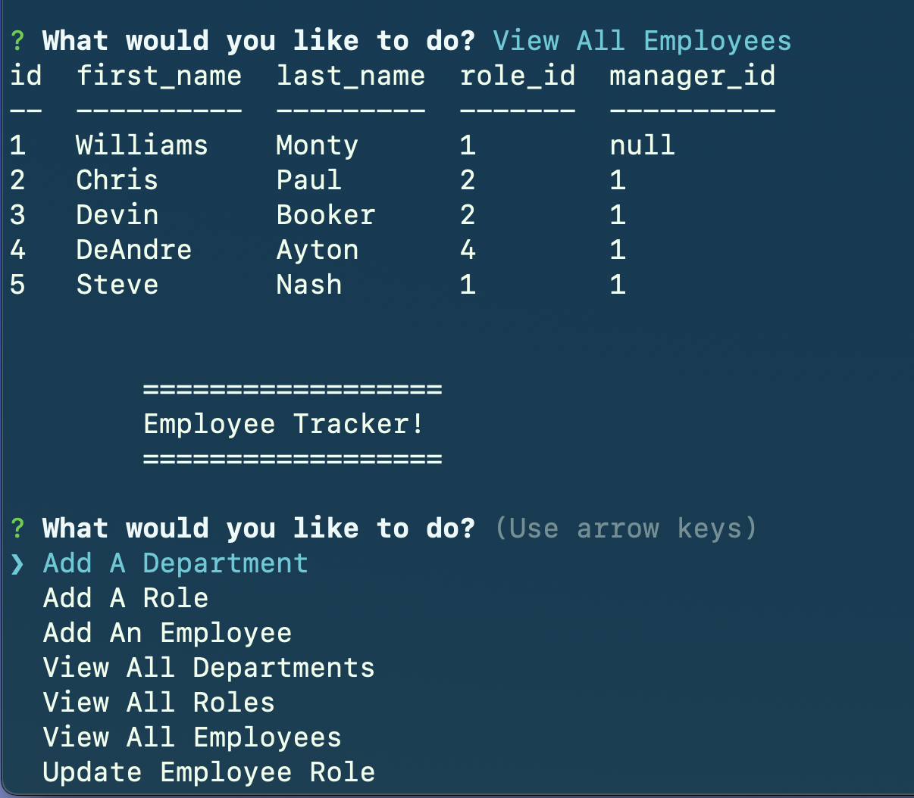

# MYSql Employee Tracker

An application using Node.JS and inquire to manage a database on employee data.

Video Walk-through Available at: https://drive.google.com/file/d/1RFD5I1cr4GsGRvd8W8mKSuyKvdYfYNVk/view

[GitHub Repo](https://github.com/Robert-Schwartz/SQL-Employee-Tracker)

## Description
an Employee database created with MySQL and manipulated using command line prompts through node.js and inquirer.

### User Story

AS A business owner:
I WANT to be able to view and manage the departments, roles, and employees in my company SO THAT I can organize and plan my business

## Table of Contents

- [Technologies](#Technologies)
- [Installation](#Installation)
- [Usage](#Usage)
- [Contributions](#Contributions)
- [Contact](#Contact)
- [License](#license)

## Technologies

This project was built using

- Javascript,
- node.js, npm inquirer
- MySQL 2
- console.table
## Installation

* Navigate to the [index.js](index.js) file and run `npm install` in your terminal.
* Make sure to download the following npm dependencies by running `npm install`
    * inquirer
    * mysql 2
    * console.table
## Usage
* Be sure to modify the [connection.js](connection.js) file to include your MySQL user/password information.
* Open a new Terminal or command line session from the root directory
* Type `npm start` in the command line to start
* `Follow the prompts` using your arrow keys to make your selection

## Contributions

Robert Schwartz

## License

No Licenses required
